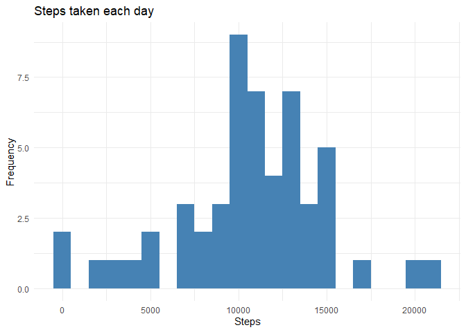
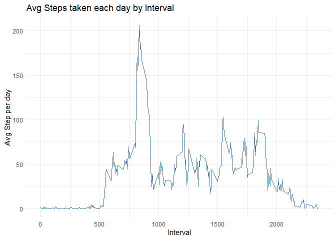
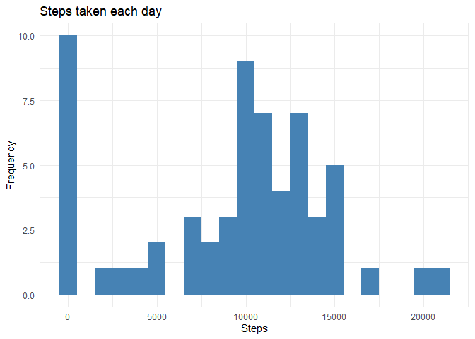
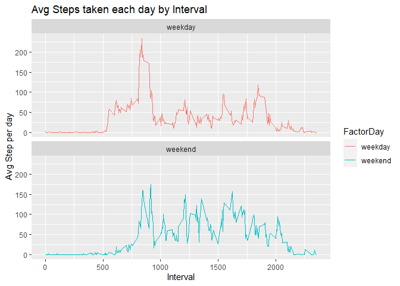

## Introduction
It is now possible to collect a large amount of data about personal movement using activity monitoring devices such as a Fitbit, Nike Fuelband, or Jawbone Up. These type of devices are part of the "quantified self" movement -- a group of enthusiasts who take measurements about themselves regularly to improve their health, to find patterns in their behavior, or because they are tech geeks. But these data remain under-utilized both because the raw data are hard to obtain and there is a lack of statistical methods and software for processing and interpreting the data.

This assignment makes use of data from a personal activity monitoring device. This device collects data at 5 minute intervals through out the day. The data consists of two months of data from an anonymous individual collected during the months of October and November, 2012 and include the number of steps taken in 5 minute intervals each day.

## Loading and preprocessing the data
Loading libraries

```r
library(ggplot2)
library(dplyr)
```

```
## 
## Attaching package: 'dplyr'
```

```
## The following objects are masked from 'package:stats':
## 
##     filter, lag
```

```
## The following objects are masked from 'package:base':
## 
##     intersect, setdiff, setequal, union
```
Unzip and loading the data

```r
unzip('activity.zip')
df <- read.csv('activity.csv')
```
## What is mean total number of steps taken per day?
1. Calculate the total number of steps taken per day

```r
StepsPerDay<- df %>%
        group_by(date) %>%
        summarise(steps = sum(steps))

StepsPerDay
```

```
## # A tibble: 61 x 2
##    date       steps
##    <chr>      <int>
##  1 2012-10-01    NA
##  2 2012-10-02   126
##  3 2012-10-03 11352
##  4 2012-10-04 12116
##  5 2012-10-05 13294
##  6 2012-10-06 15420
##  7 2012-10-07 11015
##  8 2012-10-08    NA
##  9 2012-10-09 12811
## 10 2012-10-10  9900
## # ... with 51 more rows
```
2. If you do not understand the difference between a histogram and a barplot, research the difference between them. Make a histogram of the total number of steps taken each day

```r
ggplot(data = StepsPerDay, aes(x=steps)) +
        geom_histogram(fill = 'steelblue', binwidth = 1000) +
        labs(title = 'Steps taken each day', x = 'Steps', y = 'Frequency') +
        theme_minimal()
```

```
## Warning: Removed 8 rows containing non-finite values (stat_bin).
```

<!-- -->

3. Calculate and report the mean and median of the total number of steps taken per day

```r
StepsPerDay %>%
        summarise(mean_steps = mean(steps, na.rm = TRUE), median_steps = median(steps, na.rm = TRUE))
```

```
## # A tibble: 1 x 2
##   mean_steps median_steps
##        <dbl>        <int>
## 1     10766.        10765
```

## What is the average daily activity pattern?
1. Make a time series plot (i.e. 𝚝𝚢𝚙𝚎 = "𝚕") of the 5-minute interval (x-axis) and the average number of steps taken, averaged across all days (y-axis)

```r
Intervals <- df %>%
        group_by(interval) %>%
        summarise(avg_steps = mean(steps, na.rm = TRUE))

ggplot(data = Intervals, aes(x = interval, y = avg_steps)) +
        geom_line(color = 'steelblue') +
        labs(title = 'Avg Steps taken each day by Interval', x = 'Interval', y = 'Avg Step per day') +
        theme_minimal()
```

<!-- -->

2. Which 5-minute interval, on average across all the days in the dataset, contains the maximum number of steps?

```r
Intervals %>% 
        filter(avg_steps == max(Intervals$avg_steps))
```

```
## # A tibble: 1 x 2
##   interval avg_steps
##      <int>     <dbl>
## 1      835      206.
```

## Imputing missing values
1. Calculate and report the total number of missing values in the dataset (i.e. the total number of rows with **NAs**)

```r
sum(is.na(df$steps))
```

```
## [1] 2304
```

2. Devise a strategy for filling in all of the missing values in the dataset. The strategy does not need to be sophisticated. For example, you could use the mean/median for that day, or the mean for that 5-minute interval, etc.
* Calculate the median of the dataset

```r
toFill <- median(df$steps, na.rm = TRUE)
```

* Identify the missing values

```r
missingValues <- which(is.na(df$steps))
```

3. Create a new dataset that is equal to the original dataset but with the missing data filled in.

```r
df_completed <- df
df_completed[missingValues,"steps"] <- toFill
```

4. Make a histogram of the total number of steps taken each day and Calculate and report the mean and median total number of steps taken per day. Do these values differ from the estimates from the first part of the assignment? What is the impact of imputing missing data on the estimates of the total daily number of steps?


```r
# Total number of steps taken each day
StepsPerDayCompleted <- df_completed %>%
        group_by(date) %>%
        summarise(steps = sum(steps))

# Histogram of Total number of steps taken each day
ggplot(data = StepsPerDayCompleted, aes(x=steps)) +
        geom_histogram(fill = 'steelblue', binwidth = 1000) +
        labs(title = 'Steps taken each day', x = 'Steps', y = 'Frequency') +
        theme_minimal()
```

<!-- -->

```r
# Calculate mean and media
StepsPerDayCompleted %>%
        summarise(mean_steps = mean(steps, na.rm = TRUE), median_steps = median(steps, na.rm = TRUE))
```

```
## # A tibble: 1 x 2
##   mean_steps median_steps
##        <dbl>        <dbl>
## 1      9354.        10395
```
There is a difference between Dataset with missing values and completed.

|                   | Mean     | Median |
|-------------------|----------|--------|
| Dataset with NA   | 10766.19 | 10765  |
| Complete Dataset | 9354.23  | 10395  |

## Are there differences in activity patterns between weekdays and weekends?
1. Create a new factor variable in the dataset with two levels – “weekday” and “weekend” indicating whether a given date is a weekday or weekend day.


```r
df$date <- as.Date(df$date)
df$'Day of Week' <- weekdays(df$date)
df$FactorDay <- NA

df[which(df$`Day of Week`== "Sunday" | df$`Day of Week`== "Saturday"),]$FactorDay <- "weekend"
df[which(is.na(df$FactorDay)),]$FactorDay <- "weekday"

df$FactorDay <- as.factor(df$FactorDay)
```

2. Make a panel plot containing a time series plot (i.e. \color{red}{\verb|type = "l"|}type = "l") of the 5-minute interval (x-axis) and the average number of steps taken, averaged across all weekday days or weekend days (y-axis).

```r
Intervals <- df %>%
        group_by(interval, FactorDay) %>%
        summarise(avg_steps = mean(steps, na.rm = TRUE))
Intervals
```

```
## # A tibble: 576 x 3
## # Groups:   interval [288]
##    interval FactorDay avg_steps
##       <int> <fct>         <dbl>
##  1        0 weekday       2.33 
##  2        0 weekend       0    
##  3        5 weekday       0.462
##  4        5 weekend       0    
##  5       10 weekday       0.179
##  6       10 weekend       0    
##  7       15 weekday       0.205
##  8       15 weekend       0    
##  9       20 weekday       0.103
## 10       20 weekend       0    
## # ... with 566 more rows
```

```r
ggplot(data = Intervals, aes(x = interval, y = avg_steps, color = FactorDay)) +
        geom_line() +
        facet_wrap(~FactorDay , ncol = 1, nrow=2) +
        labs(title = 'Avg Steps taken each day by Interval', x = 'Interval', y = 'Avg Step per day')
```

<!-- -->


